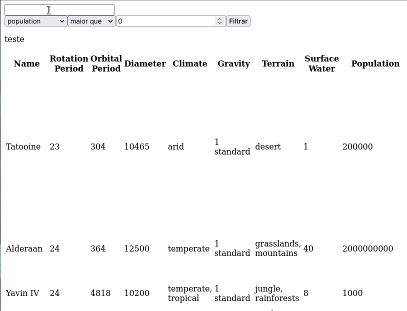

# studies-frontend-filter-planets
Made in **31/03/2022**.

## In this assignment I was learning how to use Context API and React Hooks.
#### The goal was manage the global state using Context API and to use the hooks 'useState', 'useContext' and 'useEffect'.
 

#### Here is a gif to see the filters working, as you can see, there is no CSS, so checkout my recent projects to see my new abilities.

